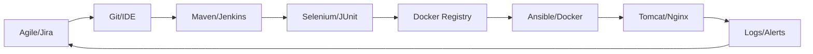

# Agile Planning and DevOps Workflow

## Product Backlog & User Stories
1. **Story 1 (Submit):** As a user, I want to submit a loan application so that it can be processed. (Acceptance: Form validates inputs, saves to DB, status is 'Submitted').
2. **Story 2 (Dashboard):** As an officer, I want to view a searchable dashboard of applications. (Acceptance: List shows ID, Name, Amount, Status. Search by ID/Name works).
3. **Story 3 (Status Update):** As an officer, I want to update application status. (Acceptance: Dropdown changes status, saves to DB).
4. **Story 4 (Details):** As a user, I want to drill down into an application to see its history. (Acceptance: Clicking ID opens detailed view).
5. **Story 5 (Indicators):** As a manager, I want to see summary indicators (total, pending, approved). (Acceptance: Dashboard header shows accurate counts).
6. **Story 6 (Alerts):** As an officer, I want to see an exception view for stalled applications. (Acceptance: Applications > 5 days in 'Submitted' are highlighted).

## 15-Task Kanban/Scrum Plan (Sprint 1)
- **To Do:** Task 5 (Feature Dev), Task 6 (MVP Complete), Task 9 (Selenium), Task 11 (Docker)
- **In Progress:** Task 1, 2, 3 (Planning & Arch), Task 4 (Git Init), Task 7 (Jenkins CI)
- **Done:** -

## Definition of Done (DoD)
- Code is peer-reviewed (PR approved).
- Unit tests pass.
- Selenium UI tests pass.
- Build is successful in Jenkins.
- Deployed successfully to the target environment (Docker/Tomcat).
- Documentation updated.

## DevOps Lifecycle Diagram

