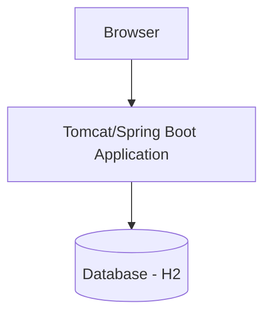

# Requirements, Architecture and Technology Setup

## SRS Summary
The Loan Application Tracking Portal is a web-based system that allows for data entry of loan applications, provides a searchable dashboard, displays summary indicators, allows drill-down into application details, and highlights exceptions/alerts.

## Technology Stack
- **Frontend:** HTML, CSS, JavaScript (Bootstrap, Thymeleaf)
- **Backend:** Java (Spring Boot)
- **Build Tool:** Maven
- **Database:** H2 (In-memory for MVP)
- **Deployment Target:** Tomcat (Embedded in Spring Boot executable JAR, deployable to Docker)
- **CI/CD:** Jenkins
- **Containerization:** Docker
- **Configuration Management:** Ansible
- **Testing:** Selenium WebDriver, JUnit

## Use-Case Diagram
```mermaid
flowchart LR
    Applicant --> (Submit Application)
    Applicant --> (View Status)
    LoanOfficer --> (View Dashboard)
    LoanOfficer --> (Update Status)
    LoanOfficer --> (View Exceptions)
```

## Architecture Diagram


## Data Model
**Table: LoanApplication**
- `id` (Long, PK)
- `applicantName` (String)
- `amount` (Double)
- `loanType` (String)
- `status` (String: SUBMITTED, REVIEW, APPROVED, REJECTED)
- `submissionDate` (Date)
- `lastUpdated` (Date)

## API List
- `POST /api/loans` - Create a new loan application.
- `GET /api/loans` - Retrieve list of applications (searchable).
- `GET /api/loans/{id}` - Retrieve specific application details.
- `PUT /api/loans/{id}/status` - Update application status.
- `GET /api/loans/summary` - Retrieve summary indicators.

## Local Development Setup
- Java JDK 17 installed.
- Maven 3.8+ installed.
- Git installed.
- IDE (IntelliJ IDEA / Eclipse / VS Code).
